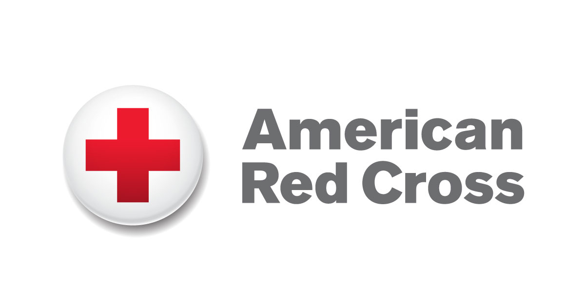

```{r setup, include=FALSE}
knitr::opts_chunk$set(warning = FALSE, message = FALSE, 
                      fig.retina = 3, fig.align = "center")
```

```{r packages-data, include=FALSE}
library(countdown)
set.seed(1234)
```

```{r xaringanExtra, echo=FALSE}
xaringanExtra::use_xaringan_extra(c("tile_view"))
```

class: center middle main-title section-title-7

# Introduction to<br>the nonprofit sector

.class-info[

**January 11, 2022**

.light[PMAP 3210: Introduction to nonprofits<br>
Andrew Young School of Policy Studies
]

]

---

name: outline
class: title title-inv-5

# Plan for today

--

.box-1.medium.sp-after-half[What are nonprofits?]

--

.box-5.medium.sp-after-half[Why do we have a class<br>just for nonprofits?]

--

.box-3.medium.sp-after-half[What are we doing this semester?]

---

layout: false
name: what-are-nonprofits
class: center middle section-title section-title-1 animated fadeIn

# What are<br>nonprofits?

---

layout: true
class: title title-1

---

# What are nonprofits?

.center[Typically, they are:]

--

.box-inv-1.medium[**Corporations**]

--

.box-inv-1.medium[with **Special Tax Status**]

--

.box-inv-1.medium[providing a **Public Good**]

???

We will discuss these three things

---

# They are ***not***…

--

.box-inv-1.medium[Prohibited from making a profit]

--

.box-inv-1.medium[Free from paying all taxes]

--

.box-inv-1[.medium[Legally accountable to donors]<br>.smaller[(except for breaking promises)]]

???

1. Nonprofits can operate at a profit, but they are not allowed to distribute the profit to shareholders.

2. Major misconception. Every nonprofit has to pay some sort of tax every year.

3. Other than for claims of fraud or, in few cases, contract, donors cannot sue nonprofits for mishandling, misusing, or wasting donated funds. Only the state attorney general can do that.

---

layout: false

.pull-left-3[
.box-1.SMALL[Corporation]

.box-inv-1.small[Legal entity]

.box-inv-1.small[Board managed]

.box-inv-1.small[No owners]

.box-inv-1.small[Organized<br>under state law]
]

--

.pull-middle-3[
.box-1.SMALL[Special tax status]

.box-inv-1.small[30+ categories of IRS tax exemption]

.box-inv-1.small[Different taxes apply differently (income, sales, property, employment, etc.)]
]

--

.pull-right-3[
.box-1.SMALL[Public good]

.box-inv-1.small[Health]

.box-inv-1.small[Arts]

.box-inv-1.small[Education]

.box-inv-1.small[Social service]

.box-inv-1.small[Civic]

.box-inv-1.small[Research]

.box-inv-1.small[Religious]
]

---

class: title title-1

# Find a nonprofit

Make a list of a few organizations you think are nonprofits

Look up a few to see if they are. What do they do? What public goods do they provide?

Hints: Look for things like "501(c)(3)", "tax exempt", or links to give donations

```{r echo=FALSE}
countdown(minutes = 4, play_sound = FALSE, font_size = "1.5em")
```

---

class: title title-1

# Find a nonprofit

Make a list of a few organizations you think are nonprofits

Look up a few to see if they are. What do they do? What public goods do they provide?

Hints: Look for things like "501(c)(3)", "tax exempt", or links to give donations

.color-2[**Share what you found with your neighbors**]

```{r echo=FALSE}
countdown(minutes = 4)
```

---

layout: true
class: middle center

---

<figure>
  
</figure>

---

<figure>
  
</figure>

---

<figure>
  
</figure>

---

<figure>
  
</figure>

---

<figure>
  
</figure>

---

<figure>
  
</figure>

---

layout: false
class: middle section-title-inv-1 animated fadeIn

.box-1.huge[Pop quiz!]

???

Source: NCCS, October 2015.

Also via the inimitable Aaron Miller.

---

layout: true
class: section-title-inv-1

---

.medium.center[

In 2016, how many nonprofit organizations<br>were registered with the IRS?

- 65,252
- 589,587
- 1,571,056

]

---

.medium.center[

In 2016, how many nonprofit organizations<br>were registered with the IRS?

- 65,252
- 589,587
- .color-7[**1,571,056**]

]

--

.box-1.small[That's one nonprofit for every 214 Americans!]

---

.medium.center[

How many of these filed a<br>990 tax return with the IRS?

- 65,252
- 589,587
- 1,571,056

]

---

.medium.center[

How many of these filed a<br>990 tax return with the IRS?

- 65,252
- .color-7[**589,587**]
- 1,571,056

]

--

.box-1.small[Not all nonprofits need to do this!]

---

.medium.center[

What percent of the US gross domestic<br>product is attributed to nonprofits?

- 2.7%
- 5.3%
- 16.1%

]

---

.medium.center[

What percent of the US gross domestic<br>product is attributed to nonprofits?

- 2.7%
- .color-7[**5.3%**]
- 16.1%

]

???

About $905 billion.

Public Charities (1.1 million) collectively managed over $3 trillion in assets.

---

.medium.center[

Which of these is the largest<br>source of revenue for nonprofits?

- Private contributions and donations
- Earned income
- Government grants

]

---

.medium.center[

Which of these is the largest<br>source of revenue for nonprofits?

- Private contributions and donations
- .color-7[**Earned income**]
- Government grants

]

--

.box-1.small[72% from earned income!]

???

Fees from government sources (primarily Medicare and Medicaid) alone account for 24.5% of nonprofit revenue.

Private giving only accounts for 13% of nonprofit revenue.

---

layout: false
name: why-focus
class: center middle section-title section-title-5 animated fadeIn

# Why do we have a<br>class just for nonprofits?

---

class: middle

.box-5.medium.sp-after[Why not just learn about<br>businesses or governments?]

.box-5.medium[What makes nonprofits unique?]

---

class: middle

.box-5.medium.sp-after[Why not just learn about<br>business management?]

.box-5.medium[What makes nonprofit<br>management unique?]

???

mission v. profit, public trust, varied funding, fundraising, measuring performance, legal context, volunteers, governance, multiple programs & constituencies

---

layout: false
name: class-overview
class: center middle section-title section-title-3 animated fadeIn

# What are we doing<br>this semester?

---

layout: true
class: title title-3

---

# Who am I?

<figure>
  
</figure>

---

# Who am I?

--

.pull-left-3[
<figure>
  
</figure>
]

--

.pull-middle-3[
<figure>
  
</figure>
]

--

.pull-right-3[
<figure>
  
</figure>
]

---

# Superheroes

.center[
<figure>
  
</figure>
]

---

# Class goals

--

.box-inv-3.less-medium[Discover a deeper appreciation<br>for the nonprofit sector]

--

.box-inv-3.less-medium[Identify the core purposes of a nonprofit]

--

.box-inv-3.less-medium[Understand what makes nonprofits unique]

--

.box-inv-3.less-medium[Create a hypothetical nonprofit!]

---

# Class readings

.pull-left.center[

<figure>
  
</figure>

]

.pull-right.small[
Gary M. Grobman, *An Introduction to the Nonprofit Sector: A Practical Approach for the Twenty-First Century*, .color-1[6th edition]

Other readings and videos
]

---

# Class website

.box-inv-3[↓ Schedule & assignments & most other content lives here ↓]

.box-inv-3[.color-5[**nonprofit**] .color-7[**sp**] .color-6[**22**] .classes.andrewheiss.com]

.box-inv-3.smaller[https://nonprofitsp22.classes.andrewheiss.com/]

.box-inv-3.small.sp-after[You'll have access to this site forever after the class is over]

--

.box-3.less-medium.sp-before[Turn stuff in at iCollege]

---

# Assignments

--

.box-inv-3.medium[Pre-class check-ins]

--

.box-inv-3.medium[Why nonprofits?]

--

.box-inv-3.medium[Team project]

--

.box-3.medium[No tests!]

---

layout: false
class: middle

.box-3.huge[Why teams?!<br>Teams are the worst.]

---

layout: true
class: title title-3

---

# Why teams?

--

.box-inv-3.less-medium[I'm not trying to be mean!]

--

.box-inv-3.less-medium[Nonprofit work is all about collaboration]

--

.box-inv-3.less-medium.sp-after[You cannot start or work in a<br>successful nonprofit without teamwork]

--

.box-3.less-medium[I'll give you tools to make teamwork suck less!]

---

# Pre-class check-ins

--

.box-inv-3[.medium[On iCollege under "Quizzes"]<br>.small[(but it's not really a quiz!)]]

--

.box-inv-3.medium[Tell me if you're in class +<br>tell me how prepared you are]

--

.box-inv-3.medium[Turn in a written response]

---

# Pandemic stuff

--

.box-inv-3.medium[Please, please, please wear a mask]

--

.box-inv-3[.medium[If you're sick, don't come to class!]<br>.small[(We'll figure out a way to get you caught up!)]]

--

.box-inv-3[.medium[Show grace and patience with each other] .small[(and with me!)]]

---

# I'm here to help!

.box-inv-3.medium[Student hours]

.box-inv-3.SMALL[E-mail, Calendly, Webex]
