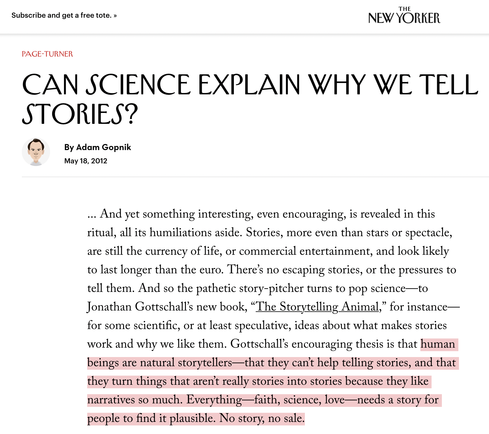
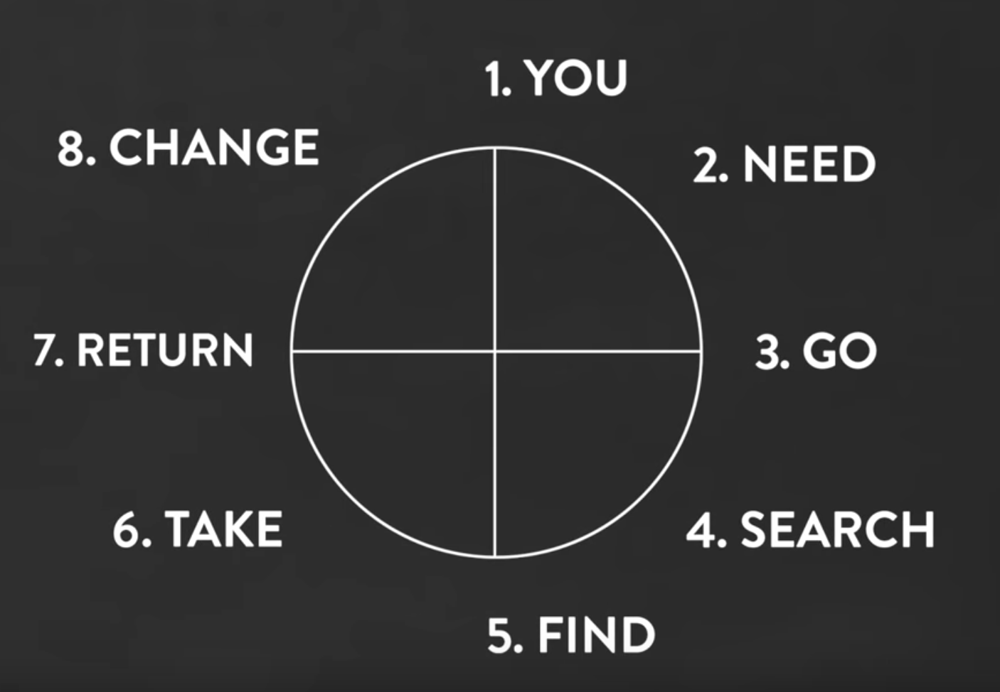
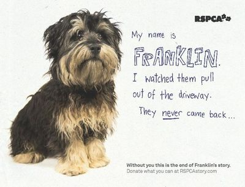
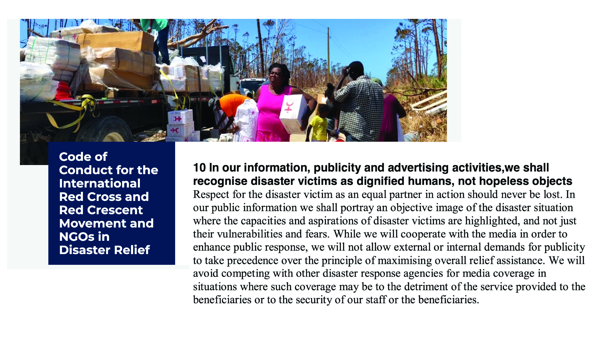
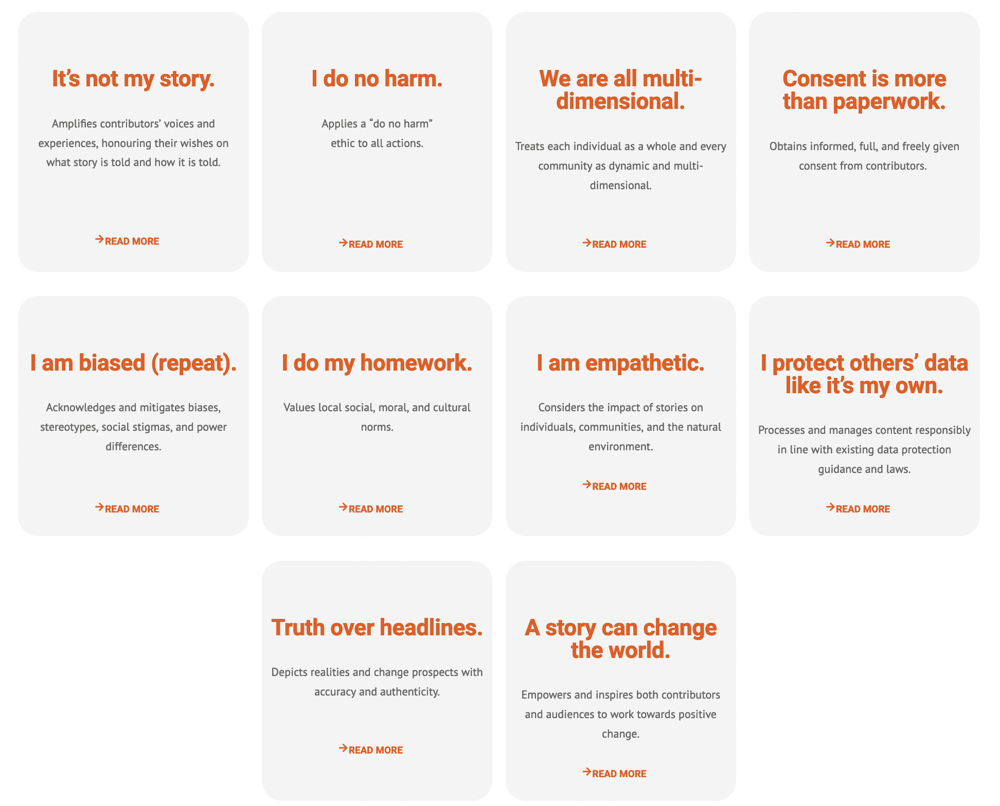

```{r setup, include=FALSE}
knitr::opts_chunk$set(warning = FALSE, message = FALSE, 
                      fig.retina = 3, fig.align = "center")
```

```{r packages-data, include=FALSE}
library(countdown)
```

```{r xaringanExtra, echo=FALSE}
xaringanExtra::use_xaringan_extra(c("tile_view"))
```

class: center middle main-title section-title-1
name: stories

# Stories

.class-info[

**March 10, 2022**

.light[PMAP 3210: Introduction to Nonprofits<br>
Andrew Young School of Policy Studies
]

]

.corner-ribbon[**Do your check-in!**]

---

layout: true
class: middle

---

.box-1.large[What are your favorite stories?]

.box-1.large[Why are they so great?]

---

.box-1.large[Why do people like stories?]

---

.center[
<figure>
  
</figure>
]

???

<https://www.newyorker.com/books/page-turner/can-science-explain-why-we-tell-stories>

---

layout: true
class: title title-1

---

# Stories

.box-inv-1.large[**Stories** are how we translate core, essential **content**<br>to different **forms**<br>for specific **audiences**.]

---

# Purpose of stories

--

.box-inv-1.less-medium[We understand the world through causal stories]

--

.box-inv-1.less-medium[Stories are how we construct our sense of self]

--

.box-inv-1.less-medium[Stories are crucial for making ideas memorable]

--

.box-inv-1.less-medium[Stories imbue our experience with meaning]

???

(Gelman and Basbøll, 2014) - "meaning" point from Mayer

---

# Script-following

.box-inv-1[Stories motivate our actions]

> When we act we are often to a great extent *enacting*, we are acting out the story as the script demands, acting in ways that are meaningful in the context of some story and that are true to our character's identity.
> 
> <small>Frederick Mayer, *Narrative and Collective Action: The Power of Public Stories*, p. 7</small>

---

layout: false
class: middle

.box-1.large[Stories lead an<br>audience on a journey]

---

layout: true
class: title title-1

---

# Story shapes

.center[
<iframe width="800" height="450" src="https://www.youtube.com/embed/oP3c1h8v2ZQ" frameborder="0" allow="accelerometer; autoplay; encrypted-media; gyroscope; picture-in-picture" allowfullscreen></iframe>
]

???

Kurt Vonnegut, https://www.youtube.com/watch?v=oP3c1h8v2ZQ

---

# Every story is the same

.center[
<iframe width="800" height="450" src="https://www.youtube.com/embed/LuD2Aa0zFiA" frameborder="0" allow="accelerometer; autoplay; encrypted-media; gyroscope; picture-in-picture" allowfullscreen></iframe>
]

???

Will Schoder, "Every Story is the Same", https://www.youtube.com/watch?v=LuD2Aa0zFiA

---

# Heroes and structure

.pull-left.center[
<figure>
  
</figure>
]

.pull-right.center[
<figure>
  
</figure>
]

???

https://commons.wikimedia.org/wiki/File:Heroesjourney.svg

5:35 from Will Schoder, "Every Story is the Same", https://www.youtube.com/watch?v=LuD2Aa0zFiA

---

layout: false
class: middle

.box-1.large[When marketing something,<br>who is the hero?]

---

layout: true
class: title title-1

---

# You are not the hero

&nbsp;

.center[
<figure>
  
  <figcaption>From Cole Nussbaumer Knaflic, <i>Storytelling with Data: A Data Visualization Guide for Business Professionals</i></figcaption>
</figure>
]

---

layout: false
class: middle

.box-1.large[The audience is the hero]

.box-inv-1.small[This is why we care about personas so much!]

---

class: middle

.center[
<figure>
  
</figure>
]

---

layout: true
class: middle

---

.box-1.medium[Do not treat those you serve as<br>helpless, incapable, opinion-less objects]

.box-inv-1.small[If the audience is the hero, those you serve are characters.<br>Don't mistreat them]

---

.box-1.large[Treat people<br>(and their stories)<br>with dignity]

---

.center[
<figure>
  
</figure>
]

???

<https://www.ifrc.org/code-conduct-international-red-cross-and-red-crescent-movement-and-ngos-disaster-relief>

---

class: middle

.center[
<iframe width="1126" height="600" src="https://www.youtube.com/embed/OXnxFjT-4mg" frameborder="0" allow="accelerometer; autoplay; encrypted-media; gyroscope; picture-in-picture" allowfullscreen></iframe>
]

---

class: title title-1

# Dignified Storytelling

.center[dignifiedstorytelling.com]

.center[
<figure>
  
</figure>
]
